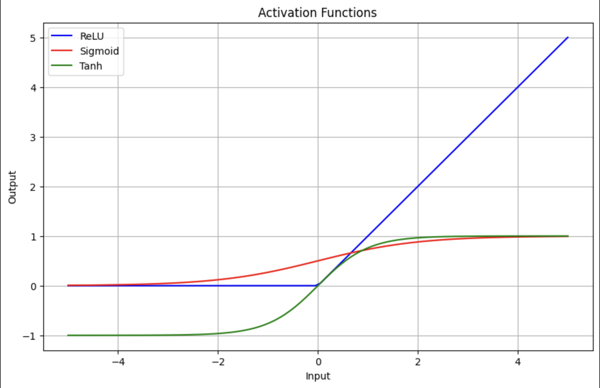
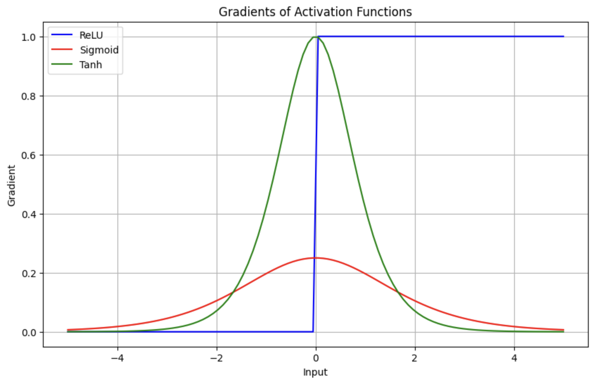

# vision-hist

A stroll down memory lane: When I first came across the transformer architecture I was amazed how such a concept came
into existence. Then I was reminded such innovations are the result of progressive and iterative processes, built upon
years of accumulated knowledge. To get a good understanding on the rationale behind specific engineering decisions its
always good to look back in history. In this series, I will delve into the evolution of vision neural network
architectures over time. I've selected a few architectures that were groundbreaking for their era, and I'll be
dissecting their papers, highlighting the novelty introduced in each architecture, and providing some intuition behind
each change. The architectures we will explore are:

* AlexNet
* VGG
* ResNet
* MobileNet
* Vision Transformers

A side note on the training data: All the papers used the ImageNet dataset for training and validation. I use
Imagenette as the dataset to evaluate the different architectures. Imagenette is a subset of 10 easily classified
classes from ImageNet (tench, English springer, cassette player, chainsaw, church, French horn, garbage truck, gas pump,
golf ball, parachute). It's smaller, making it easier to store, and it takes less time to train.

## AlexNet

The first architecture we will explore is AlexNet. This was the architecture introduced in 2012, which made waves when
it achieved a top 5 error rate of 15.3%, 10% lower than its runner-up in the ImageNet competitions. Let's go over some
key contributions of this paper.

### Architecture

The network consists of 5 convolutional layers followed by 3 fully connected layers. For the full details of the
parameters, check out the code, but here is a condensed view of what it looks like:

```
----------------------------------------------------------------
        Layer (type)               Output Shape         Param #
================================================================
            Conv2d-1           [-1, 96, 55, 55]          34,944
              ReLU-2           [-1, 96, 55, 55]               0
 LocalResponseNorm-3           [-1, 96, 55, 55]               0
         MaxPool2d-4           [-1, 96, 27, 27]               0
            Conv2d-5          [-1, 256, 27, 27]         614,656
              ReLU-6          [-1, 256, 27, 27]               0
 LocalResponseNorm-7          [-1, 256, 27, 27]               0
         MaxPool2d-8          [-1, 256, 13, 13]               0
            Conv2d-9          [-1, 384, 13, 13]         885,120
             ReLU-10          [-1, 384, 13, 13]               0
           Conv2d-11          [-1, 384, 13, 13]       1,327,488
             ReLU-12          [-1, 384, 13, 13]               0
           Conv2d-13          [-1, 256, 13, 13]         884,992
             ReLU-14          [-1, 256, 13, 13]               0
        MaxPool2d-15            [-1, 256, 6, 6]               0
          Dropout-16                 [-1, 9216]               0
           Linear-17                 [-1, 4096]      37,752,832
             ReLU-18                 [-1, 4096]               0
          Dropout-19                 [-1, 4096]               0
           Linear-20                 [-1, 4096]      16,781,312
             ReLU-21                 [-1, 4096]               0
           Linear-22                   [-1, 10]          40,970
================================================================
Total params: 58,322,314
Trainable params: 58,322,314
Non-trainable params: 0
----------------------------------------------------------------
Input size (MB): 0.59
Forward/backward pass size (MB): 14.72
Params size (MB): 222.48
Estimated Total Size (MB): 237.79
----------------------------------------------------------------
```

### ReLU Activation Function

Traditionally, neural networks used sigmoid or tanh activation functions. AlexNet uses ReLU as its activation function.
The figure below shows the 3 different activation functions and their derivatives:





As you can see, the gradients for ReLU do not saturate for high values when compared to tanh and sigmoid. This helps
with the vanishing gradient problem experienced during backpropagation when training networks. This effect is more
prominent in deeper networks; hence ReLU allows training deep CNNs.

Another feature of ReLU is its computational simplicity compared to tanh and sigmoid. It's a `max(0, x)` operation, and
the gradient is a thresholding operation.

These characteristics lend to faster training of deeper neural networks, leading to better performance.

### GPUs

AlexNet was one of the first networks to use multiple GPUs for training. The neurons in each layer were split across two
GPUs. The GPUs only communicate at certain layers. This enabled larger datasets and faster training times.

You can easily train and test on GPUs by moving the model and data to GPU.

```python
device = torch.device('cuda' if torch.cuda.is_available() else 'cpu')
model.to(device)

...

for epoch in range(num_epochs):
    for inputs, labels in dataloader:
        # run on gpu if available.
        inputs, labels = inputs.to(device), labels.to(device)
```

### Generalization

Here are some of the techniques they used for generalization:

1 - Data augmentation: They augmented the dataset by generating new images through horizontal reflection, image
translation, and altering the intensity of RGB values.

The following code achieves this easily in pytorch:

```python
transform_train = transforms.Compose([
    transforms.RandomResizedCrop(size=(model.in_dim, model.in_dim), antialias=True),
    transforms.RandomHorizontalFlip(p=0.5),
    transforms.ToTensor(),
    transforms.Normalize(mean=[0.485, 0.456, 0.406], std=[0.229, 0.224, 0.225]),
])
```

At each epoch the images are transformed by random reflection and random cropping. This will allow the model to observe
more training data and thus increasing the data distribution it's observed.

2 - Drop out regularization: They deployed dropout regularization by randomly zeroing out 50% of the neurons in the
fully connected network
during training. Add this line to your neural network to activate it.

```python
nn.Dropout(p=0.5),
```

3 - Local response normalization: Each pixel (x,y location) for each layer is normalized by the sum of all kernel values
at that pixel location within that layer. Pytorch has an implementation of local response normalization.

```python
nn.LocalResponseNorm(size=5, alpha=0.0001, beta=0.75, k=2),  # hyper parameters from paper
```

### Optimizer

The optimizer they used was SGD with momentum and weight decay. SGD uses a subset (batch) of the dataset to compute the
gradient. This makes the gradient computation a bit noisy compared to using the whole dataset. This helps with
generalization by exploring more of the cost function and helps escape local minima and saddle points. Momentum uses
infinite smoothing or IIR filtering to make the trajectory and the gradient descent algorithm smoother. Weight decay is
another way of saying L2 regularization. L2 regularization helps with over fitting by keeping the weights small, hence
preventing any one path from dominating the prediction. Pytorch has a built-in Adam optimizer with built-in weight
decay.

```python
torch.optim.AdamW(params=self.parameters(), lr=LEARNING_RATE, weight_decay=WEIGHT_DECAY)
```

### Implementation and Results

These are the hyperparameters used for training:

```python
LEARNING_RATE = 0.0001
NUM_EPOCHS = 200
BATCH_SIZE = 256
IMAGE_DIM = 227
LEARNING_RATE_DECAY_FACTOR = 0.1
LEARNING_RATE_DECAY_STEP_SIZE = 2000
WEIGHT_DECAY = 0.01
```

The SGD optimizer mentioned above didn't train. I used an AdamW optimizer which scales the gradient by the RMS value
before the update. Using this optimizer and the hyperparameters, I was able to achieve a 96% accuracy on the training
data and a 78% accuracy on the test data.

```
Epoch: 400 	Step: 14770 	Loss: 0.2250 	Acc: 93.75 %
Epoch: 400 	Step: 14780 	Loss: 0.2454 	Acc: 92.1875 %
Epoch: 400 	Step: 14790 	Loss: 0.1283 	Acc: 96.484375 %
Epoch: 400 	Step: 14800 	Loss: 0.1370 	Acc: 96.04743957519531 %
Accuracy of the network on the 10000 test images: 78.216552734375 %
training complete
testing on cuda
Accuracy of the network on the 10000 test images: 78.01273345947266 %
```

## VGG

VGG was introduced in 2014, and its main contribution was increasing the number of layers. It was able to achieve a
top-5 error rate of 8%. There was a theory that
deeper networks were more performant; however, deep networks were difficult to train. Better AIML techniques and GPU
support provided the opportunity to train deeper networks. VGG introduced different configurations, including a 16-layer
network and a 19-layer network.

### Network Architecture

VGG16 network consists of 13 convolutional layers followed by 3 fully connected layers. For the full details of the
parameters see below.

```
----------------------------------------------------------------
        Layer (type)               Output Shape         Param #
================================================================
            Conv2d-1         [-1, 64, 224, 224]           1,792
              ReLU-2         [-1, 64, 224, 224]               0
            Conv2d-3         [-1, 64, 224, 224]          36,928
              ReLU-4         [-1, 64, 224, 224]               0
         MaxPool2d-5         [-1, 64, 112, 112]               0
            Conv2d-6        [-1, 128, 112, 112]          73,856
              ReLU-7        [-1, 128, 112, 112]               0
            Conv2d-8        [-1, 128, 112, 112]         147,584
              ReLU-9        [-1, 128, 112, 112]               0
        MaxPool2d-10          [-1, 128, 56, 56]               0
           Conv2d-11          [-1, 256, 56, 56]         295,168
             ReLU-12          [-1, 256, 56, 56]               0
           Conv2d-13          [-1, 256, 56, 56]         590,080
             ReLU-14          [-1, 256, 56, 56]               0
           Conv2d-15          [-1, 256, 56, 56]         590,080
             ReLU-16          [-1, 256, 56, 56]               0
        MaxPool2d-17          [-1, 256, 28, 28]               0
           Conv2d-18          [-1, 512, 28, 28]       1,180,160
             ReLU-19          [-1, 512, 28, 28]               0
           Conv2d-20          [-1, 512, 28, 28]       2,359,808
             ReLU-21          [-1, 512, 28, 28]               0
           Conv2d-22          [-1, 512, 28, 28]       2,359,808
             ReLU-23          [-1, 512, 28, 28]               0
        MaxPool2d-24          [-1, 512, 14, 14]               0
           Conv2d-25          [-1, 512, 14, 14]       2,359,808
             ReLU-26          [-1, 512, 14, 14]               0
           Conv2d-27          [-1, 512, 14, 14]       2,359,808
             ReLU-28          [-1, 512, 14, 14]               0
           Conv2d-29          [-1, 512, 14, 14]       2,359,808
             ReLU-30          [-1, 512, 14, 14]               0
        MaxPool2d-31            [-1, 512, 7, 7]               0
          Dropout-32                [-1, 25088]               0
           Linear-33                 [-1, 4096]     102,764,544
             ReLU-34                 [-1, 4096]               0
          Dropout-35                 [-1, 4096]               0
           Linear-36                 [-1, 4096]      16,781,312
             ReLU-37                 [-1, 4096]               0
           Linear-38                   [-1, 10]          40,970
================================================================
Total params: 134,301,514
Trainable params: 134,301,514
Non-trainable params: 0
----------------------------------------------------------------
Input size (MB): 0.57
Forward/backward pass size (MB): 218.74
Params size (MB): 512.32
Estimated Total Size (MB): 731.64
----------------------------------------------------------------
```

Comparing to AlexNet, VGG16 has approximately two times more parameters.

### GPUs

AlexNet split the neurons across the GPUs. This led to some inefficiencies as certain neurons could only communicate
with neurons on the same GPU. In the VGG paper, they used multiple GPUs for data parallelism. They split each batch of
training data across GPUs. Batch gradients on each GPU are computed and averaged to obtain gradients of the full batch.
To use multiple GPUs for training on pytorch, you can specify the number of devices and use the parallel api.

```python
DEVICE_IDS = [0, 1]
model = torch.nn.parallel.DataParallel(model, device_ids=DEVICE_IDS)
```

### Weight Initialization

To initialize the network, the authors pretrained a shallower network, and then used these weights to initialize the
deeper networks. This helped training convergence. Later on, the authors mentioned that Glorot initialization, without
pretraining, resulted in the same performance. Glorot initialization takes into account the fan-in and scales the
weights, which reduces saturation during backpropagation and forward pass.

```python
nn.init.xavier_uniform_(layer.weight, gain=nn.init.calculate_gain('relu')
```

### Small Filters

The receptive field of the CNN was reduced by employing smaller convolutional filters. Most of the filters in the
network are 3x3. The intuition behind smaller filters in a deeper network was that the pace at which the feature
dimensionality was reduced was done at a slower pace. This allowed for the network to learn a rich set of features for
the image classification task. The smaller filters lend to smaller number of parameters compared to larger convolutional
filters.

### Ensemble Methods

Ensemble methods are machine learning techniques that combine multiple base models to improve predictive
performance. The underlying idea is that by combining the predictions of multiple models, you can often achieve better
results than any individual model alone. In the paper the authors combine the results of multiple trained networks with
different configurations (different number of layers) to get better generalization on test data.

### Implementation and Results

The hyperparameters for training are as follows:

```python
LEARNING_RATE = 0.0001
NUM_EPOCHS = 200
BATCH_SIZE = 256
IMAGE_DIM = 224
LEARNING_RATE_DECAY_FACTOR = 0.1
LEARNING_RATE_DECAY_STEP_SIZE = 2000
WEIGHT_DECAY = 0.01
```

I was able to achieve an 88.2% accuracy on the test data. This is a 10% improvement over AlexNet.

```
Epoch: 200 	Step: 7370 	Loss: 0.1606 	Acc: 95.3125 %
Epoch: 200 	Step: 7380 	Loss: 0.1764 	Acc: 94.140625 %
Epoch: 200 	Step: 7390 	Loss: 0.1848 	Acc: 93.75 %
Epoch: 200 	Step: 7400 	Loss: 0.1606 	Acc: 95.65217590332031 %
Accuracy of the network on the 10000 test images: 87.84712982177734 %
training complete
testing on cuda
Accuracy of the network on the 10000 test images: 88.22929382324219 %
```

## ResNet

### Network Architecture

```
----------------------------------------------------------------
        Layer (type)               Output Shape         Param #
================================================================
            Conv2d-1         [-1, 64, 112, 112]           9,472
       BatchNorm2d-2         [-1, 64, 112, 112]             128
              ReLU-3         [-1, 64, 112, 112]               0
         MaxPool2d-4           [-1, 64, 56, 56]               0
            Conv2d-5           [-1, 64, 56, 56]          36,928
       BatchNorm2d-6           [-1, 64, 56, 56]             128
              ReLU-7           [-1, 64, 56, 56]               0
            Conv2d-8           [-1, 64, 56, 56]          36,928
       BatchNorm2d-9           [-1, 64, 56, 56]             128
             ReLU-10           [-1, 64, 56, 56]               0
    ResidualBlock-11           [-1, 64, 56, 56]               0
           Conv2d-12           [-1, 64, 56, 56]          36,928
      BatchNorm2d-13           [-1, 64, 56, 56]             128
             ReLU-14           [-1, 64, 56, 56]               0
           Conv2d-15           [-1, 64, 56, 56]          36,928
      BatchNorm2d-16           [-1, 64, 56, 56]             128
             ReLU-17           [-1, 64, 56, 56]               0
    ResidualBlock-18           [-1, 64, 56, 56]               0
           Conv2d-19           [-1, 64, 56, 56]          36,928
      BatchNorm2d-20           [-1, 64, 56, 56]             128
             ReLU-21           [-1, 64, 56, 56]               0
           Conv2d-22           [-1, 64, 56, 56]          36,928
      BatchNorm2d-23           [-1, 64, 56, 56]             128
             ReLU-24           [-1, 64, 56, 56]               0
    ResidualBlock-25           [-1, 64, 56, 56]               0
           Conv2d-26          [-1, 128, 28, 28]          73,856
      BatchNorm2d-27          [-1, 128, 28, 28]             256
             ReLU-28          [-1, 128, 28, 28]               0
           Conv2d-29          [-1, 128, 28, 28]         147,584
      BatchNorm2d-30          [-1, 128, 28, 28]             256
           Conv2d-31          [-1, 128, 28, 28]           8,320
      BatchNorm2d-32          [-1, 128, 28, 28]             256
             ReLU-33          [-1, 128, 28, 28]               0
    ResidualBlock-34          [-1, 128, 28, 28]               0
           Conv2d-35          [-1, 128, 28, 28]         147,584
      BatchNorm2d-36          [-1, 128, 28, 28]             256
             ReLU-37          [-1, 128, 28, 28]               0
           Conv2d-38          [-1, 128, 28, 28]         147,584
      BatchNorm2d-39          [-1, 128, 28, 28]             256
             ReLU-40          [-1, 128, 28, 28]               0
    ResidualBlock-41          [-1, 128, 28, 28]               0
           Conv2d-42          [-1, 128, 28, 28]         147,584
      BatchNorm2d-43          [-1, 128, 28, 28]             256
             ReLU-44          [-1, 128, 28, 28]               0
           Conv2d-45          [-1, 128, 28, 28]         147,584
      BatchNorm2d-46          [-1, 128, 28, 28]             256
             ReLU-47          [-1, 128, 28, 28]               0
    ResidualBlock-48          [-1, 128, 28, 28]               0
           Conv2d-49          [-1, 128, 28, 28]         147,584
      BatchNorm2d-50          [-1, 128, 28, 28]             256
             ReLU-51          [-1, 128, 28, 28]               0
           Conv2d-52          [-1, 128, 28, 28]         147,584
      BatchNorm2d-53          [-1, 128, 28, 28]             256
             ReLU-54          [-1, 128, 28, 28]               0
    ResidualBlock-55          [-1, 128, 28, 28]               0
           Conv2d-56          [-1, 256, 14, 14]         295,168
      BatchNorm2d-57          [-1, 256, 14, 14]             512
             ReLU-58          [-1, 256, 14, 14]               0
           Conv2d-59          [-1, 256, 14, 14]         590,080
      BatchNorm2d-60          [-1, 256, 14, 14]             512
           Conv2d-61          [-1, 256, 14, 14]          33,024
      BatchNorm2d-62          [-1, 256, 14, 14]             512
             ReLU-63          [-1, 256, 14, 14]               0
    ResidualBlock-64          [-1, 256, 14, 14]               0
           Conv2d-65          [-1, 256, 14, 14]         590,080
      BatchNorm2d-66          [-1, 256, 14, 14]             512
             ReLU-67          [-1, 256, 14, 14]               0
           Conv2d-68          [-1, 256, 14, 14]         590,080
      BatchNorm2d-69          [-1, 256, 14, 14]             512
             ReLU-70          [-1, 256, 14, 14]               0
    ResidualBlock-71          [-1, 256, 14, 14]               0
           Conv2d-72          [-1, 256, 14, 14]         590,080
      BatchNorm2d-73          [-1, 256, 14, 14]             512
             ReLU-74          [-1, 256, 14, 14]               0
           Conv2d-75          [-1, 256, 14, 14]         590,080
      BatchNorm2d-76          [-1, 256, 14, 14]             512
             ReLU-77          [-1, 256, 14, 14]               0
    ResidualBlock-78          [-1, 256, 14, 14]               0
           Conv2d-79          [-1, 256, 14, 14]         590,080
      BatchNorm2d-80          [-1, 256, 14, 14]             512
             ReLU-81          [-1, 256, 14, 14]               0
           Conv2d-82          [-1, 256, 14, 14]         590,080
      BatchNorm2d-83          [-1, 256, 14, 14]             512
             ReLU-84          [-1, 256, 14, 14]               0
    ResidualBlock-85          [-1, 256, 14, 14]               0
           Conv2d-86          [-1, 256, 14, 14]         590,080
      BatchNorm2d-87          [-1, 256, 14, 14]             512
             ReLU-88          [-1, 256, 14, 14]               0
           Conv2d-89          [-1, 256, 14, 14]         590,080
      BatchNorm2d-90          [-1, 256, 14, 14]             512
             ReLU-91          [-1, 256, 14, 14]               0
    ResidualBlock-92          [-1, 256, 14, 14]               0
           Conv2d-93          [-1, 256, 14, 14]         590,080
      BatchNorm2d-94          [-1, 256, 14, 14]             512
             ReLU-95          [-1, 256, 14, 14]               0
           Conv2d-96          [-1, 256, 14, 14]         590,080
      BatchNorm2d-97          [-1, 256, 14, 14]             512
             ReLU-98          [-1, 256, 14, 14]               0
    ResidualBlock-99          [-1, 256, 14, 14]               0
          Conv2d-100            [-1, 512, 7, 7]       1,180,160
     BatchNorm2d-101            [-1, 512, 7, 7]           1,024
            ReLU-102            [-1, 512, 7, 7]               0
          Conv2d-103            [-1, 512, 7, 7]       2,359,808
     BatchNorm2d-104            [-1, 512, 7, 7]           1,024
          Conv2d-105            [-1, 512, 7, 7]         131,584
     BatchNorm2d-106            [-1, 512, 7, 7]           1,024
            ReLU-107            [-1, 512, 7, 7]               0
   ResidualBlock-108            [-1, 512, 7, 7]               0
          Conv2d-109            [-1, 512, 7, 7]       2,359,808
     BatchNorm2d-110            [-1, 512, 7, 7]           1,024
            ReLU-111            [-1, 512, 7, 7]               0
          Conv2d-112            [-1, 512, 7, 7]       2,359,808
     BatchNorm2d-113            [-1, 512, 7, 7]           1,024
            ReLU-114            [-1, 512, 7, 7]               0
   ResidualBlock-115            [-1, 512, 7, 7]               0
          Conv2d-116            [-1, 512, 7, 7]       2,359,808
     BatchNorm2d-117            [-1, 512, 7, 7]           1,024
            ReLU-118            [-1, 512, 7, 7]               0
          Conv2d-119            [-1, 512, 7, 7]       2,359,808
     BatchNorm2d-120            [-1, 512, 7, 7]           1,024
            ReLU-121            [-1, 512, 7, 7]               0
   ResidualBlock-122            [-1, 512, 7, 7]               0
       AvgPool2d-123            [-1, 512, 1, 1]               0
          Linear-124                   [-1, 10]           5,130
================================================================
Total params: 21,298,314
Trainable params: 21,298,314
Non-trainable params: 0
----------------------------------------------------------------
Input size (MB): 0.57
Forward/backward pass size (MB): 96.28
Params size (MB): 81.25
Estimated Total Size (MB): 178.10
----------------------------------------------------------------
```


### Implementation and Results

```python
LEARNING_RATE = 1e-4
NUM_EPOCHS = 200
BATCH_SIZE = 256
IMAGE_DIM = 224
LEARNING_RATE_DECAY_FACTOR = 0.1
LEARNING_RATE_DECAY_STEP_SIZE = 1000
WEIGHT_DECAY = 1e-2
```


```
Epoch: 200 	Step: 7370 	Loss: 0.1519 	Acc: 95.3125 %
Epoch: 200 	Step: 7380 	Loss: 0.1138 	Acc: 95.703125 %
Epoch: 200 	Step: 7390 	Loss: 0.1735 	Acc: 94.921875 %
Epoch: 200 	Step: 7400 	Loss: 0.2024 	Acc: 94.07115173339844 %
Accuracy of the network on the 10000 test images: 86.36942291259766 %
training complete
testing on cuda
Accuracy of the network on the 10000 test images: 86.64967346191406 %
```