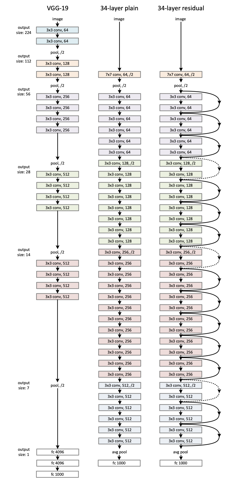
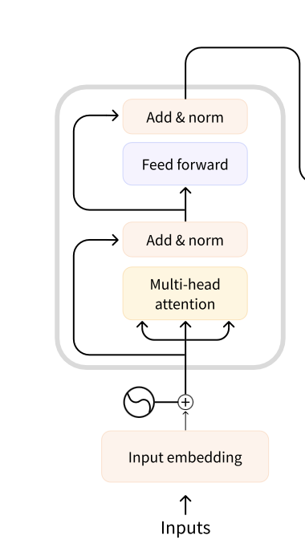
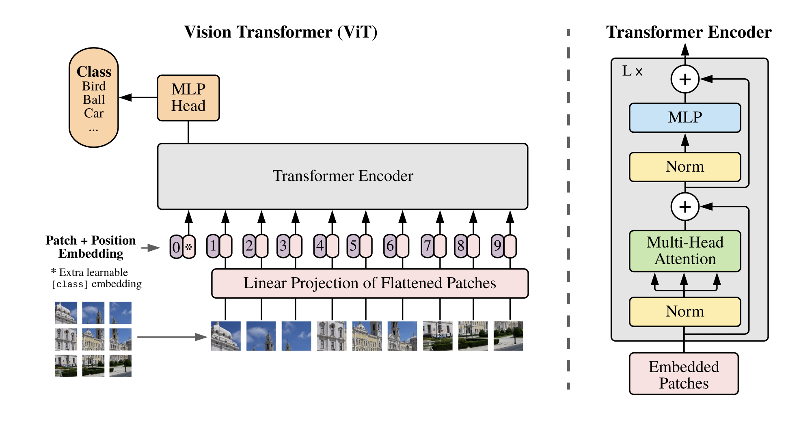

# vision-hist

A stroll down memory lane: When I first came across the transformer architecture I was impressed by the engineering
involved, and asked myself how on earth did anyone come up with this? After digging in a bit, I realized this wasn't
something that was discovered overnight. It was a result of progressive and iterative processes, built upon
years of accumulated knowledge. To get a good understanding on the rationale behind specific engineering decisions its
always good to look back in history. In this series, I will delve into the evolution of vision neural network
architectures over time. I've selected a few architectures that were groundbreaking for their era, and I'll be
dissecting their papers, highlighting the novelty introduced in each architecture, and providing some intuition behind
each change. The architectures we will explore are:

* AlexNet
* VGG
* ResNet
* Vision Transformer

A side note on the training data: All the papers used the ImageNet dataset for training and validation. I use
Imagenette as the dataset to evaluate the different architectures. Imagenette is a subset of 10 easily classified
classes from ImageNet (tench, English springer, cassette player, chainsaw, church, French horn, garbage truck, gas pump,
golf ball, parachute). It's smaller, making it easier to store, and it takes less time to train.

## AlexNet

The first architecture we will explore is AlexNet. This was the architecture introduced in 2012, which made waves when
it achieved a top 5 error rate of 15.3%, 10% lower than its runner-up in the ImageNet competitions. Let's go over some
key contributions of this paper.

### Architecture

The network consists of 5 convolutional layers followed by 3 fully connected layers. For the full details of the
parameters, check out the code, but here is a condensed view of what it looks like:

```
----------------------------------------------------------------
        Layer (type)               Output Shape         Param #
================================================================
            Conv2d-1           [-1, 96, 55, 55]          34,944
              ReLU-2           [-1, 96, 55, 55]               0
 LocalResponseNorm-3           [-1, 96, 55, 55]               0
         MaxPool2d-4           [-1, 96, 27, 27]               0
            Conv2d-5          [-1, 256, 27, 27]         614,656
              ReLU-6          [-1, 256, 27, 27]               0
 LocalResponseNorm-7          [-1, 256, 27, 27]               0
         MaxPool2d-8          [-1, 256, 13, 13]               0
            Conv2d-9          [-1, 384, 13, 13]         885,120
             ReLU-10          [-1, 384, 13, 13]               0
           Conv2d-11          [-1, 384, 13, 13]       1,327,488
             ReLU-12          [-1, 384, 13, 13]               0
           Conv2d-13          [-1, 256, 13, 13]         884,992
             ReLU-14          [-1, 256, 13, 13]               0
        MaxPool2d-15            [-1, 256, 6, 6]               0
          Dropout-16                 [-1, 9216]               0
           Linear-17                 [-1, 4096]      37,752,832
             ReLU-18                 [-1, 4096]               0
          Dropout-19                 [-1, 4096]               0
           Linear-20                 [-1, 4096]      16,781,312
             ReLU-21                 [-1, 4096]               0
           Linear-22                   [-1, 10]          40,970
================================================================
Total params: 58,322,314
Trainable params: 58,322,314
Non-trainable params: 0
----------------------------------------------------------------
Input size (MB): 0.59
Forward/backward pass size (MB): 14.72
Params size (MB): 222.48
Estimated Total Size (MB): 237.79
----------------------------------------------------------------
```

### ReLU Activation Function

Traditionally, neural networks used sigmoid or tanh activation functions. AlexNet uses ReLU as its activation function.
The figure below shows the 3 different activation functions and their derivatives:


As you can see, the gradients for ReLU do not saturate for high values when compared to tanh and sigmoid. This helps
with the vanishing gradient problem experienced during backpropagation when training networks. This effect is more
prominent in deeper networks; hence ReLU allows training deep CNNs.

Another feature of ReLU is its computational simplicity compared to tanh and sigmoid. It's a `max(0, x)` operation, and
the gradient is a thresholding operation.

These characteristics lend to faster training of deeper neural networks, leading to better performance.

### GPUs

AlexNet was one of the first networks to use multiple GPUs for training. The neurons in each layer were split across two
GPUs. The GPUs only communicate at certain layers. This enabled larger datasets and faster training times.

You can easily train and test on GPUs in pytorch by moving the model and data to GPU.

```python
device = torch.device('cuda' if torch.cuda.is_available() else 'cpu')
model.to(device)

...

for epoch in range(num_epochs):
    for inputs, labels in dataloader:
        # run on gpu if available.
        inputs, labels = inputs.to(device), labels.to(device)
```

### Generalization

Here are some of the techniques they used for generalization:

1 - Data augmentation: They augmented the dataset by generating new images through horizontal reflection, image
translation, and altering the intensity of RGB values.

The following code achieves this easily in pytorch:

```python
transform_train = transforms.Compose([
    transforms.RandomResizedCrop(size=(model.in_dim, model.in_dim), antialias=True),
    transforms.RandomHorizontalFlip(p=0.5),
    transforms.ToTensor(),
    transforms.Normalize(mean=[0.485, 0.456, 0.406], std=[0.229, 0.224, 0.225]),
])
```

At each epoch the images are transformed by random reflection and random cropping. This will allow the model to observe
more training data and thus increasing the data distribution it's observed.

2 - Drop out regularization: They deployed dropout regularization by randomly zeroing out 50% of the neurons in the
fully connected network
during training. Add this line to your neural network to activate it.

```python
nn.Dropout(p=0.5),
```

3 - Local response normalization: Each pixel (x,y location) for each layer is normalized by the sum of all kernel values
at that pixel location within that layer. Pytorch has an implementation of local response normalization.

```python
nn.LocalResponseNorm(size=5, alpha=0.0001, beta=0.75, k=2),  # hyper parameters from paper
```

### Optimizer

The optimizer they used was SGD with momentum and weight decay. SGD uses a subset (batch) of the dataset to compute the
gradient. This makes the gradient computation a bit noisy compared to using the whole dataset. This helps with
generalization by exploring more of the cost function and helps escape local minima and saddle points. Momentum uses
infinite smoothing or IIR filtering to make the trajectory and the gradient descent algorithm smoother. Weight decay is
another way of saying L2 regularization. L2 regularization helps with over fitting by keeping the weights small, hence
preventing any one path from dominating the prediction. Pytorch has a built-in Adam optimizer with built-in weight
decay.

```python
torch.optim.AdamW(params=self.parameters(), lr=LEARNING_RATE, weight_decay=WEIGHT_DECAY)
```

### Implementation and Results

These are the hyperparameters used for training:

```python
LEARNING_RATE = 0.0001
NUM_EPOCHS = 200
BATCH_SIZE = 256
IMAGE_DIM = 227
LEARNING_RATE_DECAY_FACTOR = 0.1
LEARNING_RATE_DECAY_STEP_SIZE = 2000
WEIGHT_DECAY = 0.01
```

The SGD optimizer mentioned above didn't train. I used an AdamW optimizer which scales the gradient by the RMS value
before the update. Using this optimizer and the hyperparameters, I was able to achieve a 78% accuracy on the test data.

```
Epoch: 400 	Step: 14770 	Loss: 0.2250 	Acc: 93.75 %
Epoch: 400 	Step: 14780 	Loss: 0.2454 	Acc: 92.1875 %
Epoch: 400 	Step: 14790 	Loss: 0.1283 	Acc: 96.484375 %
Epoch: 400 	Step: 14800 	Loss: 0.1370 	Acc: 96.04743957519531 %
Accuracy of the network on the 10000 test images: 78.216552734375 %
training complete
testing on cuda
Accuracy of the network on the 10000 test images: 78.01273345947266 %
```

## VGG

VGG was introduced in 2014, and its main contribution was increasing the number of layers. It was able to achieve a
top-5 error rate of 8%. There was a theory that
deeper networks were more performant; however, deep networks were difficult to train. Better AIML techniques and GPU
support provided the opportunity to train deeper networks. VGG introduced different configurations, including a 16-layer
network and a 19-layer network.

### Network Architecture

VGG16 network consists of 13 convolutional layers followed by 3 fully connected layers. For the full details of the
parameters see below.

```
----------------------------------------------------------------
        Layer (type)               Output Shape         Param #
================================================================
            Conv2d-1         [-1, 64, 224, 224]           1,792
              ReLU-2         [-1, 64, 224, 224]               0
            Conv2d-3         [-1, 64, 224, 224]          36,928
              ReLU-4         [-1, 64, 224, 224]               0
         MaxPool2d-5         [-1, 64, 112, 112]               0
            Conv2d-6        [-1, 128, 112, 112]          73,856
              ReLU-7        [-1, 128, 112, 112]               0
            Conv2d-8        [-1, 128, 112, 112]         147,584
              ReLU-9        [-1, 128, 112, 112]               0
        MaxPool2d-10          [-1, 128, 56, 56]               0
           Conv2d-11          [-1, 256, 56, 56]         295,168
             ReLU-12          [-1, 256, 56, 56]               0
           Conv2d-13          [-1, 256, 56, 56]         590,080
             ReLU-14          [-1, 256, 56, 56]               0
           Conv2d-15          [-1, 256, 56, 56]         590,080
             ReLU-16          [-1, 256, 56, 56]               0
        MaxPool2d-17          [-1, 256, 28, 28]               0
           Conv2d-18          [-1, 512, 28, 28]       1,180,160
             ReLU-19          [-1, 512, 28, 28]               0
           Conv2d-20          [-1, 512, 28, 28]       2,359,808
             ReLU-21          [-1, 512, 28, 28]               0
           Conv2d-22          [-1, 512, 28, 28]       2,359,808
             ReLU-23          [-1, 512, 28, 28]               0
        MaxPool2d-24          [-1, 512, 14, 14]               0
           Conv2d-25          [-1, 512, 14, 14]       2,359,808
             ReLU-26          [-1, 512, 14, 14]               0
           Conv2d-27          [-1, 512, 14, 14]       2,359,808
             ReLU-28          [-1, 512, 14, 14]               0
           Conv2d-29          [-1, 512, 14, 14]       2,359,808
             ReLU-30          [-1, 512, 14, 14]               0
        MaxPool2d-31            [-1, 512, 7, 7]               0
          Dropout-32                [-1, 25088]               0
           Linear-33                 [-1, 4096]     102,764,544
             ReLU-34                 [-1, 4096]               0
          Dropout-35                 [-1, 4096]               0
           Linear-36                 [-1, 4096]      16,781,312
             ReLU-37                 [-1, 4096]               0
           Linear-38                   [-1, 10]          40,970
================================================================
Total params: 134,301,514
Trainable params: 134,301,514
Non-trainable params: 0
----------------------------------------------------------------
Input size (MB): 0.57
Forward/backward pass size (MB): 218.74
Params size (MB): 512.32
Estimated Total Size (MB): 731.64
----------------------------------------------------------------
```

Comparing to AlexNet, VGG16 has approximately two times more parameters.

### GPUs

AlexNet split the neurons across the GPUs. This led to some inefficiencies as certain neurons could only communicate
with neurons on the same GPU. In the VGG paper, they used multiple GPUs for data parallelism. They split each batch of
training data across GPUs. Batch gradients on each GPU are computed and averaged to obtain gradients of the full batch.
To use multiple GPUs for training on pytorch, you can specify the number of devices and use the parallel api.

```python
DEVICE_IDS = [0, 1]
model = torch.nn.parallel.DataParallel(model, device_ids=DEVICE_IDS)
```

### Glorot Initialization

To initialize the network, the authors pretrained a shallower network, and then used these weights to initialize the
deeper networks. This helped training convergence. Later on, the authors mentioned that Glorot initialization, without
pretraining, resulted in the same performance. Glorot initialization described in "Understanding the difficulty of
training deep feedforward neural networks - Glorot, X. & Bengio, Y. (2010).", takes into account the fan-in and scales
the
weights, which reduces saturation during backpropagation and forward pass. For glorot, also known as xavier
initialization the weights are drawn from a distribution with its variance scale by the (fan_in + fan_out).

```python
nn.init.xavier_uniform_(layer.weight, gain=nn.init.calculate_gain('relu')
```

### Small Filters

The receptive field of the CNN was reduced by employing smaller convolutional filters. Most of the filters in the
network are 3x3. The intuition behind smaller filters in a deeper network was that the pace at which the feature
dimensionality was reduced was done at a slower pace. This allowed for the network to learn a rich set of features for
the image classification task. The smaller filters lend to smaller number of parameters compared to larger convolutional
filters.

### Ensemble Methods

Ensemble methods are machine learning techniques that combine multiple base models to improve predictive
performance. The underlying idea is that by combining the predictions of multiple models, you can often achieve better
results than any individual model alone. In the paper the authors combine the results of multiple trained networks with
different configurations (different number of layers) to get better generalization on test data.

### Implementation and Results

The hyperparameters for training are as follows:

```python
LEARNING_RATE = 0.0001
NUM_EPOCHS = 200
BATCH_SIZE = 256
IMAGE_DIM = 224
LEARNING_RATE_DECAY_FACTOR = 0.1
LEARNING_RATE_DECAY_STEP_SIZE = 2000
WEIGHT_DECAY = 0.01
```

I was able to achieve an 85.7% accuracy on the test data. This is a 8% improvement over AlexNet.

```
Epoch: 200 	Step: 7370 	Loss: 0.2355 	Acc: 94.140625 %
Epoch: 200 	Step: 7380 	Loss: 0.2629 	Acc: 91.40625 %
Epoch: 200 	Step: 7390 	Loss: 0.1777 	Acc: 92.578125 %
Epoch: 200 	Step: 7400 	Loss: 0.2086 	Acc: 94.07115173339844 %
Accuracy of the network on the 10000 test images: 86.08916473388672 %
training complete
testing on cuda
Accuracy of the network on the 10000 test images: 85.73248291015625 %
```

## ResNet

After VGG showed promising results, it was understood that deeper networks provide better performance. However, deeper
networks were harder to train and suffered from vanishing gradient or exploding gradient problem. Batch normalization
and proper initialization of the weights did help in that regard, however, the solvers were still having convergence
issues, and the deeps networks weren't as performant. The solution proposed by He et al. in "Deep Residual Learning for
Image Recognition" was to introduce skip connections or
residual connections that pass the input to the output. The structure is shown in the figure below. This residual
connection, enabled optimizers to converge, and allowed deeper CNNs. This allowed ResNet32 to have 8 times the depth of
a
VGG16, yet have fewer parameters.



### Batch Norm

Batch normalization is a technique used in training neural networks that helps to improve the training speed,
performance, and stability of the model. It was introduced by Sergey Ioffe and Christian Szegedy in 2015 in their
paper "Batch Normalization: Accelerating Deep Network Training by Reducing Internal Covariate Shift." Batch
normalization, or Batch norm, normalizes the inputs of each layer within a network during training. The goal is to
ensure that the inputs to a layer are more standardized, which helps the network learn more effectively. It does this by
first removing the sample mean, and then normalizing by the sample variance for the batch. It then introduces two
learnable parameters for the network to scale and shift the samples. A moving average of the mean and variance is
tracked during training, to be used at inference time.

Some limitations of batch normalization is its sensitivity to the batch size, as the normalization statistics are
computed over the batch. The other issue is the discrepancies in model behavior between
training and inference. During training normalization is done on the batch statistics, however, at inference time these
batch statistics are replaced with the moving averages.

The input to batch norm is of shape [B, H, W, C] = [batch, height, width, channel]. The statistics are computed over B,
H, W, resulting in C values for mean and variance. These C values are used to normalize the samples across the channels,
resulting in an output of size [B, H, W, C].

```python
nn.BatchNorm2d(out_channels),
```

### He Initialization

He initialization, also known as Kaiming initialization, described in "Delving deep into rectifiers: Surpassing
human-level performance on ImageNet classification - He, K. et al. (2015)." was designed for networks with ReLU
activation. As in glorot initialization, the variance of the distribution is scaled by fan in, to keep consistent
statistics across activations. In addition, the variance is multiplied by two to compensate for the ReLU activation.
ReLU can potentially create imbalance in the variance of the activations because they push half their output
to zero. He initialization compensates for this effect.

```python
nn.init.kaiming_normal_(m.weight, mode='fan_out', nonlinearity='relu')
```

### Network Architecture

ResNet is composed of multiple residual blocks of varying output channel sizes. Each residual block is composed of two
convolution layers followed by batch norms with a residual connection at the output. There is a total of 16 blocks, plus
a single convolution layer at the beginning and a fully connected layer at the end, resulting in 34 layers and 21
million parameters.

```
----------------------------------------------------------------
        Layer (type)               Output Shape         Param #
================================================================
            Conv2d-1         [-1, 64, 112, 112]           9,472
       BatchNorm2d-2         [-1, 64, 112, 112]             128
              ReLU-3         [-1, 64, 112, 112]               0
         MaxPool2d-4           [-1, 64, 56, 56]               0
            Conv2d-5           [-1, 64, 56, 56]          36,928
       BatchNorm2d-6           [-1, 64, 56, 56]             128
              ReLU-7           [-1, 64, 56, 56]               0
            Conv2d-8           [-1, 64, 56, 56]          36,928
       BatchNorm2d-9           [-1, 64, 56, 56]             128
             ReLU-10           [-1, 64, 56, 56]               0
    ResidualBlock-11           [-1, 64, 56, 56]               0
           Conv2d-12           [-1, 64, 56, 56]          36,928
      BatchNorm2d-13           [-1, 64, 56, 56]             128
             ReLU-14           [-1, 64, 56, 56]               0
           Conv2d-15           [-1, 64, 56, 56]          36,928
      BatchNorm2d-16           [-1, 64, 56, 56]             128
             ReLU-17           [-1, 64, 56, 56]               0
    ResidualBlock-18           [-1, 64, 56, 56]               0
           Conv2d-19           [-1, 64, 56, 56]          36,928
      BatchNorm2d-20           [-1, 64, 56, 56]             128
             ReLU-21           [-1, 64, 56, 56]               0
           Conv2d-22           [-1, 64, 56, 56]          36,928
      BatchNorm2d-23           [-1, 64, 56, 56]             128
             ReLU-24           [-1, 64, 56, 56]               0
    ResidualBlock-25           [-1, 64, 56, 56]               0
           Conv2d-26          [-1, 128, 28, 28]          73,856
      BatchNorm2d-27          [-1, 128, 28, 28]             256
             ReLU-28          [-1, 128, 28, 28]               0
           Conv2d-29          [-1, 128, 28, 28]         147,584
      BatchNorm2d-30          [-1, 128, 28, 28]             256
           Conv2d-31          [-1, 128, 28, 28]           8,320
      BatchNorm2d-32          [-1, 128, 28, 28]             256
             ReLU-33          [-1, 128, 28, 28]               0
    ResidualBlock-34          [-1, 128, 28, 28]               0
           Conv2d-35          [-1, 128, 28, 28]         147,584
      BatchNorm2d-36          [-1, 128, 28, 28]             256
             ReLU-37          [-1, 128, 28, 28]               0
           Conv2d-38          [-1, 128, 28, 28]         147,584
      BatchNorm2d-39          [-1, 128, 28, 28]             256
             ReLU-40          [-1, 128, 28, 28]               0
    ResidualBlock-41          [-1, 128, 28, 28]               0
           Conv2d-42          [-1, 128, 28, 28]         147,584
      BatchNorm2d-43          [-1, 128, 28, 28]             256
             ReLU-44          [-1, 128, 28, 28]               0
           Conv2d-45          [-1, 128, 28, 28]         147,584
      BatchNorm2d-46          [-1, 128, 28, 28]             256
             ReLU-47          [-1, 128, 28, 28]               0
    ResidualBlock-48          [-1, 128, 28, 28]               0
           Conv2d-49          [-1, 128, 28, 28]         147,584
      BatchNorm2d-50          [-1, 128, 28, 28]             256
             ReLU-51          [-1, 128, 28, 28]               0
           Conv2d-52          [-1, 128, 28, 28]         147,584
      BatchNorm2d-53          [-1, 128, 28, 28]             256
             ReLU-54          [-1, 128, 28, 28]               0
    ResidualBlock-55          [-1, 128, 28, 28]               0
           Conv2d-56          [-1, 256, 14, 14]         295,168
      BatchNorm2d-57          [-1, 256, 14, 14]             512
             ReLU-58          [-1, 256, 14, 14]               0
           Conv2d-59          [-1, 256, 14, 14]         590,080
      BatchNorm2d-60          [-1, 256, 14, 14]             512
           Conv2d-61          [-1, 256, 14, 14]          33,024
      BatchNorm2d-62          [-1, 256, 14, 14]             512
             ReLU-63          [-1, 256, 14, 14]               0
    ResidualBlock-64          [-1, 256, 14, 14]               0
           Conv2d-65          [-1, 256, 14, 14]         590,080
      BatchNorm2d-66          [-1, 256, 14, 14]             512
             ReLU-67          [-1, 256, 14, 14]               0
           Conv2d-68          [-1, 256, 14, 14]         590,080
      BatchNorm2d-69          [-1, 256, 14, 14]             512
             ReLU-70          [-1, 256, 14, 14]               0
    ResidualBlock-71          [-1, 256, 14, 14]               0
           Conv2d-72          [-1, 256, 14, 14]         590,080
      BatchNorm2d-73          [-1, 256, 14, 14]             512
             ReLU-74          [-1, 256, 14, 14]               0
           Conv2d-75          [-1, 256, 14, 14]         590,080
      BatchNorm2d-76          [-1, 256, 14, 14]             512
             ReLU-77          [-1, 256, 14, 14]               0
    ResidualBlock-78          [-1, 256, 14, 14]               0
           Conv2d-79          [-1, 256, 14, 14]         590,080
      BatchNorm2d-80          [-1, 256, 14, 14]             512
             ReLU-81          [-1, 256, 14, 14]               0
           Conv2d-82          [-1, 256, 14, 14]         590,080
      BatchNorm2d-83          [-1, 256, 14, 14]             512
             ReLU-84          [-1, 256, 14, 14]               0
    ResidualBlock-85          [-1, 256, 14, 14]               0
           Conv2d-86          [-1, 256, 14, 14]         590,080
      BatchNorm2d-87          [-1, 256, 14, 14]             512
             ReLU-88          [-1, 256, 14, 14]               0
           Conv2d-89          [-1, 256, 14, 14]         590,080
      BatchNorm2d-90          [-1, 256, 14, 14]             512
             ReLU-91          [-1, 256, 14, 14]               0
    ResidualBlock-92          [-1, 256, 14, 14]               0
           Conv2d-93          [-1, 256, 14, 14]         590,080
      BatchNorm2d-94          [-1, 256, 14, 14]             512
             ReLU-95          [-1, 256, 14, 14]               0
           Conv2d-96          [-1, 256, 14, 14]         590,080
      BatchNorm2d-97          [-1, 256, 14, 14]             512
             ReLU-98          [-1, 256, 14, 14]               0
    ResidualBlock-99          [-1, 256, 14, 14]               0
          Conv2d-100            [-1, 512, 7, 7]       1,180,160
     BatchNorm2d-101            [-1, 512, 7, 7]           1,024
            ReLU-102            [-1, 512, 7, 7]               0
          Conv2d-103            [-1, 512, 7, 7]       2,359,808
     BatchNorm2d-104            [-1, 512, 7, 7]           1,024
          Conv2d-105            [-1, 512, 7, 7]         131,584
     BatchNorm2d-106            [-1, 512, 7, 7]           1,024
            ReLU-107            [-1, 512, 7, 7]               0
   ResidualBlock-108            [-1, 512, 7, 7]               0
          Conv2d-109            [-1, 512, 7, 7]       2,359,808
     BatchNorm2d-110            [-1, 512, 7, 7]           1,024
            ReLU-111            [-1, 512, 7, 7]               0
          Conv2d-112            [-1, 512, 7, 7]       2,359,808
     BatchNorm2d-113            [-1, 512, 7, 7]           1,024
            ReLU-114            [-1, 512, 7, 7]               0
   ResidualBlock-115            [-1, 512, 7, 7]               0
          Conv2d-116            [-1, 512, 7, 7]       2,359,808
     BatchNorm2d-117            [-1, 512, 7, 7]           1,024
            ReLU-118            [-1, 512, 7, 7]               0
          Conv2d-119            [-1, 512, 7, 7]       2,359,808
     BatchNorm2d-120            [-1, 512, 7, 7]           1,024
            ReLU-121            [-1, 512, 7, 7]               0
   ResidualBlock-122            [-1, 512, 7, 7]               0
       AvgPool2d-123            [-1, 512, 1, 1]               0
          Linear-124                   [-1, 10]           5,130
================================================================
Total params: 21,298,314
Trainable params: 21,298,314
Non-trainable params: 0
----------------------------------------------------------------
Input size (MB): 0.57
Forward/backward pass size (MB): 96.28
Params size (MB): 81.25
Estimated Total Size (MB): 178.10
----------------------------------------------------------------
```

### Implementation and Results

The hyperparameters for training are as follows:

```python
LEARNING_RATE = 1e-4
NUM_EPOCHS = 200
BATCH_SIZE = 256
IMAGE_DIM = 224
LEARNING_RATE_DECAY_FACTOR = 0.1
LEARNING_RATE_DECAY_STEP_SIZE = 1000
WEIGHT_DECAY = 1e-2
```

I was able to achieve an 86.6% accuracy on the test data. This is a very slight improvement over VGG16 (less than 1%),
however, ResNet has 6x fewer parameters than VGG16.

```
Epoch: 200 	Step: 7370 	Loss: 0.1519 	Acc: 95.3125 %
Epoch: 200 	Step: 7380 	Loss: 0.1138 	Acc: 95.703125 %
Epoch: 200 	Step: 7390 	Loss: 0.1735 	Acc: 94.921875 %
Epoch: 200 	Step: 7400 	Loss: 0.2024 	Acc: 94.07115173339844 %
Accuracy of the network on the 10000 test images: 86.36942291259766 %
training complete
testing on cuda
Accuracy of the network on the 10000 test images: 86.64967346191406 %
```

## Vision Transformer

We now move on to vision transformers. Transformers made waves when first introduced in "Attention Is All You Need -
Viswani, A. et al. (2017)"
and have had significant impact in natural language processing (NLP). The architectures enabled massive parallelism in
training large corpus of text on multiple GPUs. These models are comprised of billions of parameters and are
known as large language models. They have showed successful in chatbots, and AI assistants, and are now being used
in vision applications. We'll fist explore the encoder transformer architecture as used in NLP, and see how it's adapted
for vision. The architecture is shown below, we will go through each in detail.



### Input Embedding

The input to the transformer is referred to as tokens. In NLP token are words or sub-words, and are one hot encoded into
a unique vector for each token. The input token vectors are then converted to a more dense vector (reducing its
dimensionality) known as the embedding. The conversion is usually a feed forward network and the parameters are learned
during training. The goal of the embedding step is twofold. First, it's to represent tokens in a lower dimensional and
more dense vector space, to increase computational efficiency. Second, is to gain some understanding of the language and
place similar words closer together in the embedding space.

### Positional Encoding

In NLP the location of the tokens contribute to their meaning. For example, "is" at the beginning of the sentence vs the
middle of the sentence, may have a different meaning and significance. When the sentence is tokenized and embedded, the
positional information is lost. To recapture this information a precomputed vector, that depends on the position of the
token is added to the embedding, to preserve the order of the sequence.

### Encoder Block

#### Self Attention

This component allows the model to weigh the importance of different words in the sequence, regardless of their
position. For each token, the transformer calculates a set of query (Q), key (K), and value (V) vectors by transforming
the embedding vector using learned weights. The model then computes an attention score, by computing the dot product of
the query vector with all key vectors and applies a softmax function to determine the weights for the values. This score
tells the model what tokens are important to the current token. The attention scores are then used to create a
weighted sum of the value vectors, resulting in an output that is sensitive to the entire input sequence.

The process describe above is a self attention head. Multiple of these heads are used in the transformer to compose the
multi head attention block. The output of the multi-head attention are concatenated and then passed through a learned
linear layer, to compress the dimensionality back to the embedding length.

A similarity can be seen between the self attention block of a transformer and the convolution step in CNNs. The
convolution layer, tries to find correlations
between adjacent samples, and as you go deeper into the network the receptive field increases, and a wider set of
correlations are obtained. Self attention, similarly tries to find correlation between the different tokens in a
sequence.

A layer normalization and a residual connection is added to the output of the multi-head attention block.

#### Layer Normalization and Residual Connection

You've seen residual connections and normalization in ResNet and as mentioned they help with keeping the statistics of
the activations and gradients from exploding or vanishing, and help the optimizer to converge.

The normalization used in the transformer architecture is layer norm and not batch norm. Batch normalization is not
suitable for sequence prediction tasks due to the following reasons:

* Variable sequence length: NLP commonly has variable input length which pose a problem for batch normalization in
  batches with different number of samples. This can lead to misleading batch statistics and impact model performance.
* Dynamics of sequences: Traditionally, NLP used RNNs which would process the input sequentially, and state of the
  network at any time depended
  on the previous step. Batch normalization, which normalizes input features across the batch, may disrupt this temporal
  dependency, as it normalizes across an entire batch for each feature independently of the sequence order or context.
* Small batch size: Traditionally training in NLP was done in small batches, due to memory constraints. These small
  batches pose a problem for batch normalization as the estimates of batch statistics become less accurate.

Layer norm which was introduced in "Layer Normalization. - Lei Ba, J. et al (2016)" hoped to resolve the issues
mentioned above. It computes the statistics used for normalization over the incoming pre-activations for a single
sample. So if the input is of size [B, S, E] = [batch, sequence, embedding], layer norm computes a single mean and
variance over the E dimension, resulting in a different mean and variance at each time step for each sample. The
pre-activations are normalized by this mean and variance, and a learnable beta and gamma are introduced as in batch
norm. You can see how layer norm is independent of the batch size or sequence length. As in batch norm, layer norm
helped stabilized training, leading to faster convergence of the optimizer.

#### Feed Forward Network

A feed forward network, or sometimes referred to as a multi-layer perceptron (MLP), which is typically composed of two
linear layers with ReLU activation, further processes and
transforms the embeddings adding another level of representational learning. Another layer norm and residual connection
is added after this feed forward network.

### Encoder

The encoder takes a number of these encoder blocks described above and sequentially stacks them together. Finally a
layer norm can
be added at the output.

### Head

A task specific head is attached to the output of the encoder, which is usually one or multiple linear layers with
non-linear activation. The
reason for a separate head block is to have different heads for different tasks, while reusing the same weights in the
encoder block. For-example, a model was trained for sentiment analysis, and now we want to train it for named entity
recognition (NER). We can re-initialize all the weights and retrain the whole model for NER, but this approach is
inefficient, and will take a long time to train. A more efficient approach is to remove the head of
the model, use another head for NER, set the encoder weights to the values used for sentiment analysis and only
re-initialize the weights for the head. The model is now trained for NER, and training will complete at a much faster
pace. This is also referred to as fine-tuning.

### ViT

The vision transformer uses the exact architecture described above. The only issue to solve is how to feed an image to
an architecture expecting tokens. "An Image is Worth 16x16 Words: Transformers for Image Recognition at Scale -
Dosovitskiy, A. et al. (2020)." solved it by splitting the image into patches, serializing the patches and having
these patches represent the tokens. The remaining steps are exactly described above.



ViT uses GeLU as its non-linearity. GeLU is smoother than ReLU and has been shown to
learn more complex data patterns in deep learning. However, it is more computationally inefficient compared to ReLU.


### Network Architecture

The architecture is shown below, and has 57 million parameters, twice the size of ResNet.

```
----------------------------------------------------------------
        Layer (type)               Output Shape         Param #
================================================================
            Conv2d-1          [-1, 768, 14, 14]         590,592
           Dropout-2             [-1, 197, 768]               0
         LayerNorm-3             [-1, 197, 768]           1,536
MultiheadAttention-4  [[-1, 197, 768], [-1, 197, 197]]               0
           Dropout-5             [-1, 197, 768]               0
         LayerNorm-6             [-1, 197, 768]           1,536
            Linear-7            [-1, 197, 3072]       2,362,368
              GELU-8            [-1, 197, 3072]               0
           Dropout-9            [-1, 197, 3072]               0
           Linear-10             [-1, 197, 768]       2,360,064
          Dropout-11             [-1, 197, 768]               0
         MlpBlock-12             [-1, 197, 768]               0
     EncoderBlock-13             [-1, 197, 768]               0
        LayerNorm-14             [-1, 197, 768]           1,536
MultiheadAttention-15  [[-1, 197, 768], [-1, 197, 197]]               0
          Dropout-16             [-1, 197, 768]               0
        LayerNorm-17             [-1, 197, 768]           1,536
           Linear-18            [-1, 197, 3072]       2,362,368
             GELU-19            [-1, 197, 3072]               0
          Dropout-20            [-1, 197, 3072]               0
           Linear-21             [-1, 197, 768]       2,360,064
          Dropout-22             [-1, 197, 768]               0
         MlpBlock-23             [-1, 197, 768]               0
     EncoderBlock-24             [-1, 197, 768]               0
        LayerNorm-25             [-1, 197, 768]           1,536
MultiheadAttention-26  [[-1, 197, 768], [-1, 197, 197]]               0
          Dropout-27             [-1, 197, 768]               0
        LayerNorm-28             [-1, 197, 768]           1,536
           Linear-29            [-1, 197, 3072]       2,362,368
             GELU-30            [-1, 197, 3072]               0
          Dropout-31            [-1, 197, 3072]               0
           Linear-32             [-1, 197, 768]       2,360,064
          Dropout-33             [-1, 197, 768]               0
         MlpBlock-34             [-1, 197, 768]               0
     EncoderBlock-35             [-1, 197, 768]               0
        LayerNorm-36             [-1, 197, 768]           1,536
MultiheadAttention-37  [[-1, 197, 768], [-1, 197, 197]]               0
          Dropout-38             [-1, 197, 768]               0
        LayerNorm-39             [-1, 197, 768]           1,536
           Linear-40            [-1, 197, 3072]       2,362,368
             GELU-41            [-1, 197, 3072]               0
          Dropout-42            [-1, 197, 3072]               0
           Linear-43             [-1, 197, 768]       2,360,064
          Dropout-44             [-1, 197, 768]               0
         MlpBlock-45             [-1, 197, 768]               0
     EncoderBlock-46             [-1, 197, 768]               0
        LayerNorm-47             [-1, 197, 768]           1,536
MultiheadAttention-48  [[-1, 197, 768], [-1, 197, 197]]               0
          Dropout-49             [-1, 197, 768]               0
        LayerNorm-50             [-1, 197, 768]           1,536
           Linear-51            [-1, 197, 3072]       2,362,368
             GELU-52            [-1, 197, 3072]               0
          Dropout-53            [-1, 197, 3072]               0
           Linear-54             [-1, 197, 768]       2,360,064
          Dropout-55             [-1, 197, 768]               0
         MlpBlock-56             [-1, 197, 768]               0
     EncoderBlock-57             [-1, 197, 768]               0
        LayerNorm-58             [-1, 197, 768]           1,536
MultiheadAttention-59  [[-1, 197, 768], [-1, 197, 197]]               0
          Dropout-60             [-1, 197, 768]               0
        LayerNorm-61             [-1, 197, 768]           1,536
           Linear-62            [-1, 197, 3072]       2,362,368
             GELU-63            [-1, 197, 3072]               0
          Dropout-64            [-1, 197, 3072]               0
           Linear-65             [-1, 197, 768]       2,360,064
          Dropout-66             [-1, 197, 768]               0
         MlpBlock-67             [-1, 197, 768]               0
     EncoderBlock-68             [-1, 197, 768]               0
        LayerNorm-69             [-1, 197, 768]           1,536
MultiheadAttention-70  [[-1, 197, 768], [-1, 197, 197]]               0
          Dropout-71             [-1, 197, 768]               0
        LayerNorm-72             [-1, 197, 768]           1,536
           Linear-73            [-1, 197, 3072]       2,362,368
             GELU-74            [-1, 197, 3072]               0
          Dropout-75            [-1, 197, 3072]               0
           Linear-76             [-1, 197, 768]       2,360,064
          Dropout-77             [-1, 197, 768]               0
         MlpBlock-78             [-1, 197, 768]               0
     EncoderBlock-79             [-1, 197, 768]               0
        LayerNorm-80             [-1, 197, 768]           1,536
MultiheadAttention-81  [[-1, 197, 768], [-1, 197, 197]]               0
          Dropout-82             [-1, 197, 768]               0
        LayerNorm-83             [-1, 197, 768]           1,536
           Linear-84            [-1, 197, 3072]       2,362,368
             GELU-85            [-1, 197, 3072]               0
          Dropout-86            [-1, 197, 3072]               0
           Linear-87             [-1, 197, 768]       2,360,064
          Dropout-88             [-1, 197, 768]               0
         MlpBlock-89             [-1, 197, 768]               0
     EncoderBlock-90             [-1, 197, 768]               0
        LayerNorm-91             [-1, 197, 768]           1,536
MultiheadAttention-92  [[-1, 197, 768], [-1, 197, 197]]               0
          Dropout-93             [-1, 197, 768]               0
        LayerNorm-94             [-1, 197, 768]           1,536
           Linear-95            [-1, 197, 3072]       2,362,368
             GELU-96            [-1, 197, 3072]               0
          Dropout-97            [-1, 197, 3072]               0
           Linear-98             [-1, 197, 768]       2,360,064
          Dropout-99             [-1, 197, 768]               0
        MlpBlock-100             [-1, 197, 768]               0
    EncoderBlock-101             [-1, 197, 768]               0
       LayerNorm-102             [-1, 197, 768]           1,536
MultiheadAttention-103  [[-1, 197, 768], [-1, 197, 197]]               0
         Dropout-104             [-1, 197, 768]               0
       LayerNorm-105             [-1, 197, 768]           1,536
          Linear-106            [-1, 197, 3072]       2,362,368
            GELU-107            [-1, 197, 3072]               0
         Dropout-108            [-1, 197, 3072]               0
          Linear-109             [-1, 197, 768]       2,360,064
         Dropout-110             [-1, 197, 768]               0
        MlpBlock-111             [-1, 197, 768]               0
    EncoderBlock-112             [-1, 197, 768]               0
       LayerNorm-113             [-1, 197, 768]           1,536
MultiheadAttention-114  [[-1, 197, 768], [-1, 197, 197]]               0
         Dropout-115             [-1, 197, 768]               0
       LayerNorm-116             [-1, 197, 768]           1,536
          Linear-117            [-1, 197, 3072]       2,362,368
            GELU-118            [-1, 197, 3072]               0
         Dropout-119            [-1, 197, 3072]               0
          Linear-120             [-1, 197, 768]       2,360,064
         Dropout-121             [-1, 197, 768]               0
        MlpBlock-122             [-1, 197, 768]               0
    EncoderBlock-123             [-1, 197, 768]               0
       LayerNorm-124             [-1, 197, 768]           1,536
MultiheadAttention-125  [[-1, 197, 768], [-1, 197, 197]]               0
         Dropout-126             [-1, 197, 768]               0
       LayerNorm-127             [-1, 197, 768]           1,536
          Linear-128            [-1, 197, 3072]       2,362,368
            GELU-129            [-1, 197, 3072]               0
         Dropout-130            [-1, 197, 3072]               0
          Linear-131             [-1, 197, 768]       2,360,064
         Dropout-132             [-1, 197, 768]               0
        MlpBlock-133             [-1, 197, 768]               0
    EncoderBlock-134             [-1, 197, 768]               0
       LayerNorm-135             [-1, 197, 768]           1,536
         Encoder-136             [-1, 197, 768]               0
          Linear-137                   [-1, 10]           7,690
================================================================
Total params: 57,305,866
Trainable params: 57,305,866
Non-trainable params: 0
----------------------------------------------------------------
Input size (MB): 0.57
Forward/backward pass size (MB): 537297.50
Params size (MB): 218.60
Estimated Total Size (MB): 537516.68
----------------------------------------------------------------
```

### Implementation and Results

The hyperparameters for training are as follows:

```python
LEARNING_RATE = 1e-4
NUM_EPOCHS = 200
BATCH_SIZE = 256
IMAGE_DIM = 224
LEARNING_RATE_DECAY_FACTOR = 0.1
LEARNING_RATE_DECAY_STEP_SIZE = 1000
WEIGHT_DECAY = 1e-2
```

I was only able to achieve a 68% accuracy. The authors of the paper mentioned, for the best results, they first trained
the ViT on a massive corpus of data. And then they fine-tuned the model for a more specific task. In the future I would
like to pre-initialize the weights from their model, and fine-tune for this classification task.

```
Epoch: 200 	Step: 7370 	Loss: 0.3008 	Acc: 88.28125 %
Epoch: 200 	Step: 7380 	Loss: 0.4843 	Acc: 83.984375 %
Epoch: 200 	Step: 7390 	Loss: 0.3834 	Acc: 88.28125 %
Epoch: 200 	Step: 7400 	Loss: 0.3539 	Acc: 88.14229583740234 %
Accuracy of the network on the 10000 test images: 69.29936218261719 %
training complete
testing on cuda
Accuracy of the network on the 10000 test images: 68.84075927734375 %
```

## Final Thoughts

We've reached the end of our journey. We started looking at AlexNet which kick-started the deeplearning craze. VGGs made
networks deeper by using smaller filters. In the ResNet section, we were introduced to residual connections and batch
normalizations, which sped up training. Finally, Transformer model was introduced, and ViT adapted this architecture for
the use of vision applications. Hopefully by introductions concepts gradually, you were able to get a better
understanding of deeplearning techniques, and why certain decisions were made. For future work more architectures can be
explored, including SWIN and DaViT.